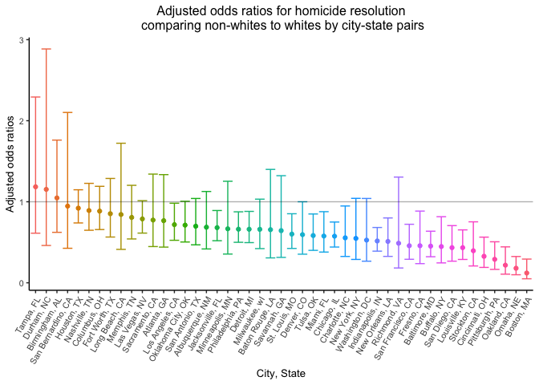
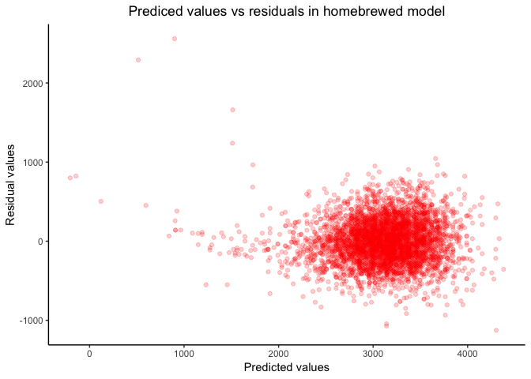
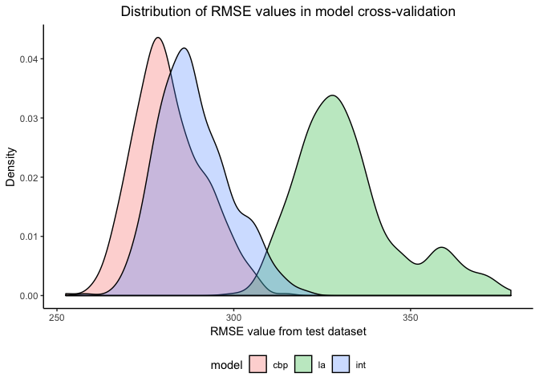

Homework 6
================
Christian Pascual
11/15/2018

Bringing in the usual suspects
==============================

``` r
library(tidyverse)
library(leaps)
library(modelr)
library(mgcv)

knitr::opts_chunk$set(
  out.width = "90%"
)

theme_set(theme_classic() + 
            theme(legend.position = "bottom", 
                  plot.title = element_text(hjust = 0.5)))

set.seed(1111)
```

Bringing in `tidyverse` to do the heavy lifting with data cleaning, analysis and plotting. `leaps` is included for a stepwise regression. `modelr` and `mgcv` are here for cross-validation and model comparison.

Problem 1
=========

Data Wrangling
--------------

First, we need to bring in the data for analysis.

``` r
homicides = read.csv(file = "./data/homicide-data.csv") 
```

In its current form, `homicides` has 52179 rows and 12 columns.

Like in the last homework, we'll create a `city-state` variable to hold a more descriptive name for each city. We'll need to filter out some cities that don't report race and then alter some columns on the victim characteristics.

``` r
cities_to_remove = c("Dallas, TX", "Phoenix, AZ", "Kansas City, MO")
clean_homicides = homicides %>% 
  mutate(city_state = paste(city, state, sep = ", "),
         is_white = ifelse(victim_race == "White", "white", "nonwhite"),
         victim_race = fct_relevel(is_white, "white"),
         victim_age = as.numeric(victim_age),
         was_resolved = ifelse(disposition == "Closed by arrest", 1, 0)) %>% 
  filter(!(city_state %in% cities_to_remove))
```

Our cleaning results in a dataset that is 48508 rows and 15 columns. This dataset will be used in our regression analyses.

Logistic Regression on Baltimore
--------------------------------

With this data, we'll use `glm` to create a logisitic regression to predict if a crime will be solved based on the victim's age, sex and race.

``` r
baltimore_glm = clean_homicides %>% 
  filter(city_state == "Baltimore, MD") %>% 
  glm(was_resolved ~ victim_age + victim_sex + victim_race, 
      data = ., family = binomial())
```

With this model on hand, we can calculate the odds ratios needed for the problem.

``` r
coeffs = broom::tidy(baltimore_glm) %>% 
  mutate(OR = exp(estimate)) 

knitr::kable(coeffs)
```

| term                 |    estimate|  std.error|  statistic|    p.value|         OR|
|:---------------------|-----------:|----------:|----------:|----------:|----------:|
| (Intercept)          |   1.0473606|  0.2265545|   4.622996|  0.0000038|  2.8501185|
| victim\_age          |  -0.0037403|  0.0030328|  -1.233272|  0.2174741|  0.9962667|
| victim\_sexMale      |  -0.8845347|  0.1361009|  -6.499110|  0.0000000|  0.4129062|
| victim\_racenonwhite |  -0.7929220|  0.1742183|  -4.551312|  0.0000053|  0.4525206|

From the table, we can see that homicide cases among non-whites are much less likely to be solved compared to cases among white people. The adjusted odds ratio is 0.453 with a p-value of 5.331248210^{-6}, indicating statistically significant difference on a 95% confidence level.

All City Regression
-------------------

The above analysis lays out the groundwork for applying it to all the cities as a whole. From the orignial `clean_homicides` dataset, we'll create a new tibble that also contains the odds ratios and confidence intervals. Since both the estimates are in terms of logarithms, we need to transform both the estimate odds ratio and confidence intervals back.

``` r
# Function to apply the logit to all cities
resolve_logit = function(df) {
  return(glm(was_resolved ~ victim_age + victim_sex + victim_race, 
            data = df, family = binomial()))
}

city_odds = clean_homicides %>% 
  group_by(city_state) %>% 
  nest() %>% 
  mutate(model = map(data, resolve_logit),
         coeffs = map(model, broom::tidy)) %>% 
  unnest(coeffs) %>% 
  filter(term == "victim_racenonwhite") %>% 
  mutate(OR = exp(estimate),
         conf.low = exp(estimate - std.error * 1.96),
         conf.high = exp(estimate + std.error * 1.96)) %>% 
  select(city_state, OR, conf.low, conf.high)
```

The above pipeline produces a tidy dataset, complete with the estimated adjusted odds ratios and associated confidence intervals. Now we can plot these and see how it ranges between the cities in the Washington Post dataset.

``` r
ggplot(data = city_odds, aes(x = reorder(city_state, -OR), y = OR,
                             color = reorder(city_state, -OR))) +
  geom_point() +
  geom_errorbar(aes(ymin = conf.low, ymax = conf.high)) +
  geom_hline(yintercept = 1, alpha = 0.3) +
  theme(legend.position = "none", 
        axis.text.x = element_text(angle = 60, hjust = 1),
        text = element_text(size = 10)) +
  labs(
    title = "Adjusted odds ratios for homicide resolution\n comparing non-whites to whites by city-state pairs",
    x = "City, State",
    y = "Adjusted odds ratios"
  )
```



With the exception of Tampa, Durham and Birmingham, most of the cities in the dataset have point estimates for adjusted odds ratios less than 1. In fact, the cities with the largest adjusted odds ratios seem to have the largest confidence intervals, suggestive of relatively small presence in `clean_homcides`. Any adjusted odds ratio under 1 implies that less homicides are solved for non-whites compared to whites.

The odds ratios are sorted in descending order for easier visual comparison. The 95% confidence intervals show that not as many of the point estimates do not rule out the null hypothesis that `aOR = 1`. I've added a line at `OR = 1` for emphasis. Taking the confidence intervals into account, it looks that city-states don't start looking significantly biased against non-whites until Jacksonville.

Problem 2
=========

Data Wrangling
--------------

This dataset concerns child birthweight and various factors that contribute to its increase or decrease.

``` r
bwt = read_csv(file = "./data/birthweight.csv",
                        col_types = "dddddddddddddddddddd") 
```

In its raw form, `bwt` has 4342 rows and 20 columns. This dataset will be used for regression analysis, so we'll clean the data to make sure that each variable is in proper format. Numbers need to be numbers, and categories should be factors.

``` r
clean_bwt = bwt %>% 
  mutate(babysex = as.factor(ifelse(babysex == 1, "Male", "Female")),
         frace = as.factor(frace),
         malform = as.factor(ifelse(malform == 0, "Absent", "Present")),
         mrace = as.factor(mrace)) %>% 
  select(bwt, everything())
```

There are 0 columns with missing values, so we don't have to worry about missing data.

Making my own model
-------------------

We are trying to using regression analyses to understand which factors are associated with `bwt` (child birthweight). With 19 available predictors, we need to pare down the covariates in such a way that leaves us with a good subset.

Before I can start, I need to consider multicollinearity within the data. Using `cor(bwt)`, I've found that `frace`-`mrace`, `ppwt-ppbmi` and `ppwt-blength` are highly correlated (&gt;0.85), and thus should not be included with each other in the model.

For this purpose, I'll first use stepwise regression to find a good starting point for my regression model. Then, I'll consider other factors included by the stepwise regression and further pare down the model to something reasonably parsimonious.

``` r
saturated_model = lm(bwt ~ ., data = clean_bwt)
step_regress = step(saturated_model, direction = 'both')
```

``` r
knitr::kable(broom::tidy(step_regress))
```

| term        |       estimate|    std.error|   statistic|    p.value|
|:------------|--------------:|------------:|-----------:|----------:|
| (Intercept) |  -6070.2638943|  136.9081478|  -44.338222|  0.0000000|
| babysexMale |    -28.5580171|    8.4548958|   -3.377690|  0.0007374|
| bhead       |    130.7770408|    3.4465672|   37.944144|  0.0000000|
| blength     |     74.9471109|    2.0190479|   37.120027|  0.0000000|
| delwt       |      4.1067316|    0.3920592|   10.474775|  0.0000000|
| fincome     |      0.3180229|    0.1747477|    1.819898|  0.0688436|
| gaweeks     |     11.5924873|    1.4620657|    7.928842|  0.0000000|
| mheight     |      6.5940377|    1.7848817|    3.694383|  0.0002231|
| mrace2      |   -138.7924801|    9.9070869|  -14.009414|  0.0000000|
| mrace3      |    -74.8867755|   42.3146313|   -1.769761|  0.0768374|
| mrace4      |   -100.6781427|   19.3246910|   -5.209819|  0.0000002|
| parity      |     96.3046933|   40.3362158|    2.387549|  0.0170038|
| ppwt        |     -2.6755853|    0.4273585|   -6.260752|  0.0000000|
| smoken      |     -4.8434197|    0.5855757|   -8.271210|  0.0000000|

The resulting stepwise regression results in a model with 14 coefficients. This model still seems too big to use effectively, we would prefer smaller models to stop ourselves from overfitting. The range of `bwt` ranges from hundreds to thousands, so I would suspect that covariates that don't contribute much can be safely removed. This would enable us to hone in on the greatest contributors to birthweight.

With this in mind, we'll remove `delwt`, `fincome`, `mheight`, `ppwt`, `gaweeks` and `smoken` from the model. Thus, my final proposed model will include: `babysex`, `bhead`, `blength`, `mrace`, and `parity`.

Knowing that we'll need to cross-validate my model later, I'll store this new model as a function:

``` r
cbp_model = function(df) {
  return(
    lm(bwt ~ babysex + bhead + blength + mrace + parity, 
       data = df)
  )
}
```

Now I can judge my model's accuracy based on a predicted-residuals graph:

``` r
clean_bwt %>% 
  add_predictions(cbp_model(.)) %>% 
  add_residuals(cbp_model(.)) %>% 
  ggplot(data = ., aes(x = pred, y = resid)) +
  geom_point(alpha = 0.2, color = "red") +
  labs(
    title = "Prediced values vs residuals in homebrewed model",
    x = "Predicted values",
    y = "Residual values"
  )
```



From this vaguely fish-like graph, we can see that my model isn't great. Most residuals lie within a band ranging from -1000 to 1000. However, the residuals do not form the desired horizontal band across the range of predicted values. Prior to 2500, we see that the residuals taper off towards 0, but there are also only a few values at these predictions. There are about 5 babies that have residuals outside this band, suggesting that these children may be outliers. Unfortunately, my model also predicts that 2 children will have little to negative weight.

From here, we can judge my model against some standard ones set forth by the problem. In order to compare them, we'll use cross-validation.

Cross validation and other models
---------------------------------

The two models given are one using birth length and gestational age, and another using head circumference, birth length, sex and all interactions between these 3. We'll set up for the cross-validation by storing these models as funcitons to `map` over multiple training and test datasets.

``` r
length_age_model = function(df) {
  return(
    lm(bwt ~ blength + gaweeks, data = df)
  )
}

interactions_model = function(df) {
  return(
    lm(bwt ~ bhead + blength + babysex + 
         bhead*blength + bhead*babysex + blength*babysex +
         bhead*blength*babysex,
       data = df)
  )
}
```

Now we can use `modelr` and `mgcv` to automate the cross-validation process and get a good representation of the relative merit of our 3 models.

``` r
cv = crossv_mc(clean_bwt, 500) %>% 
  # Train the models on the training data
  mutate(cbp_model = map(train, cbp_model),
         la_model = map(train, length_age_model),
         interact_model = map(train, interactions_model)) %>% 
  # Calculate RMSE from the test data
  mutate(rmse_cbp = map2_dbl(cbp_model, test, ~rmse(model = .x, data = .y)),
         rmse_la = map2_dbl(la_model, test, ~rmse(model = .x, data = .y)),
         rmse_int = map2_dbl(interact_model, test, ~rmse(model = .x, data = .y)))
```

In the above code, we did 3 important tasks. We first split up our `clean_bwt` dataset into a training and test dataset for cross-validation. We then applied each of our models on the training data to create models for each training-test pair. Finally, we calculated many RMSE measures that we can use to get an idea of the range of "correctness" of each model. We'll graph out the RMSE for each model below and see if there are any clear winners.

``` r
# Code taken and slightly adapted from lecture
cv %>% 
  select(starts_with("rmse")) %>% 
  gather(key = model, value = rmse) %>% 
  mutate(model = str_replace(model, "rmse_", ""),
         model = fct_inorder(model)) %>% 
  ggplot(data = ., aes(rmse, fill = model)) + 
  geom_density(alpha = 0.3) +
  labs(
    title = "Distribution of RMSE values in model cross-validation",
    x = "RMSE value from test dataset",
    y = "Density"
  )
```



In a surprising turn of events, my model seems to do slightly better than the interactions model and much better than the length-age model. My model's success is probably mostly due to the stepwise regression I used to pick out some initial covariates. It's important to note that I chose my model in consideration for only the greatest contributors to `bwt` and gave minimal attention to any biological mechanisms that may actually contribute to higher or lower birthweight. There are still those 5 babies whose birthweights my model still predicts horribly on, but these should be considered in outlier analysis.
